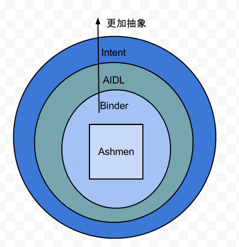

# AidlDemo

对于AIDL的一些使用：最基础使用、稍高级使用、......

详细开发文档见各分支的README.md文件

# 效果演示

# 基本概念-此章节可能和本仓库没有太大关系，了解一下即可

## 图片解释

## 全称与中文名

- IPC：Inter-Process Communication（进程间通信）
- Ashmem：Anonymous Shared Memory（匿名共享内存）
- Binder：Binder（进程间通信机制）
- AIDL：Android Interface Definition Language（android接口定义语言）
- Intent：Intent（意图）

## 基本概念

- IPC：一种概念，即进程间通信
- Ashmem：作用之一是通过Binder进程间通信机制来实现进程间的内存共享
- Binder：对IPC的具体实行，是IPC的一种具体实现
- AIDL：Binder机制向外提供的接口，目的是为了方便调用Binder
- Intent：最高层级的封装，实质上封装了对Binder的使用

# 分支

master分支包含最新代码，其他分支的代码最终都将合并到master分支上

最基础使用分支：feature/aidl_base，[传送门](https://github.com/fengqingxiuyi/AidlDemo/tree/feature/aidl_base)

稍高级使用分支：feature/aidl_advanced，[传送门](https://github.com/fengqingxiuyi/AidlDemo/tree/feature/aidl_advanced)

# 目前存在问题

- unBindService之后，IAidlBinder的对象不为null