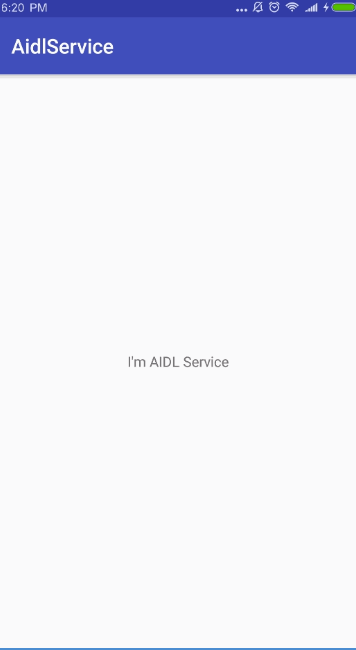

# AidlDemo

对于AIDL【Android Interface Definition Language(android接口定义语言)】的一些使用：最基础使用、稍高级使用、......

# Gif



# 注意

***基本开发流程：先开发Service端，后开发Client端***

***使用AndroidStudio创建AidlDemo工程后，再在里面创建Service Module和Client Module，不用管默认的app Module***

# 开发流程-最基础使用

***分支：feature/aidl_base***

## Service端

***包名：com.fqxyi.aidlservice***

1、创建aidl文件，如：`IAidlBinder.aidl`，新增接口，如：`String getInfo();`

2、检查`build/generated/source/aidl/debug`下是否存在对应的java文件，若无则`Rebuild Project`，若出现错误，请查看[#FAQ](#FAQ)章节

3、创建继承于android.app.Service的Service类，如：`AidlService.java`，并实现必须要实现的onBind方法

3.1、在AndroidManifest.xml文件中静态注册Service，详细注册代码如下：

```xml
<!-- exported表示是否支持其它应用调用当前组件 -->
<!-- process表示将组建运行到单独的进程中 -->
<!-- action用于用于过滤识别其他的Intent -->
<service android:name=".AidlService"
  android:exported="true"
  android:process=":Remote">
  <intent-filter>
      <action android:name="com.fqxyi.aidlservice.remote"/>
  </intent-filter>
</service>
```

4、接着我们回到AidlService.java文件，onBind方法需要我们返回一个IBinder对象。显然，到目前为止能够得到IBinder对象的类只有通过IAidlBinder.aidl自动生成的IAidlBinder.java类。

由于默认代码格式很乱，所以为了方便查看，我们可以使用快捷键格式化一下代码：`Ctrl(Command)+Alt(Option)+L`

仔细阅读代码发现，我们想要得到的IBinder对象是通过asBinder()方法返回的，所以接下来我们只需要返回一个IAidlBinder.Stub的对象就可以了。

5、实例化IAidlBinder.Stub的对象之后，我们可以处理我们自定义的方法getInfo()，比如最简单的就是返回一串字符串：`return "I'm a Server";`

## Client端

***包名：com.fqxyi.aidlclient***

1、将Service端的aidl文件，拷贝到main文件夹下，需要注意的是aidl文件的包名还是Service端的包名，具体目录结构如下：

```
aidlclient
    |--src
        |--main
            |--aidl
                |--com.fqxyi.aidlservice // Service端的包名
                    |--IAidlBinder.aidl
```

2、检查`build/generated/source/aidl/debug`下是否存在对应的java文件，若无则`Rebuild Project`，若出现错误，请查看[#FAQ](#FAQ)章节

3、创建Intent对象并实例化，接着配置在Service端配置的`action`，实现Service的绑定，具体代码如下所以：

```java
Intent intent = new Intent();
intent.setAction("com.fqxyi.aidlservice.remote");
intent.setPackage("com.fqxyi.aidlservice");
bindService(intent, conn, Context.BIND_AUTO_CREATE);
```

4、上述代码因不存在ServiceConnection而报错，所以很简单，我们需要创建一个ServiceConnection对象并实例化，接着在必须要实现的onServiceConnected(ComponentName name, IBinder service)方法中`初始化IAidlBinder`，在onServiceDisconnected(ComponentName name)方法中`将IAidlBinder置为null`。

仔细阅读IAidlBinder.java代码发现，我们想要得到的IAidlBinder对象是通过asInterface(android.os.IBinder obj)方法返回的，需要传入一个IBinder对象，所以接下来就很简单了，只需要如下代码即可：

```java
IAidlBinder.Stub.asInterface(service);
```

5、最后我们只需要通过第4步得到的IAidlBinder对象，调用getInfo()方法，就可以得到内容。

# FAQ

## Service

### ProcessException: Error while executing process aidl with arguments ...

```bash
Error:Execution failed for task ':aidlservice:compileDebugAidl'.
> java.lang.RuntimeException: com.android.ide.common.process.ProcessException: Error while executing process /qingfeng/work/sdk/build-tools/25.0.2/aidl with arguments {-p/qingfeng/work/sdk/platforms/android-25/framework.aidl -o/qingfeng/data/openSource/AidlDemo/aidlservice/build/generated/source/aidl/debug -I/qingfeng/data/openSource/AidlDemo/aidlservice/src/main/aidl -I/qingfeng/data/openSource/AidlDemo/aidlservice/src/debug/aidl -I/Users/qingfeng/.android/build-cache/92fb7eb4401d63eb124015b36c2a8a534302f1c9/output/aidl -d/var/folders/tq/f6kngw516g15xs24gdh80qvh0000gn/T/aidl1446680322459273337.d /qingfeng/data/openSource/AidlDemo/aidlservice/src/main/aidl/com/fqxyi/aidlservice/IAidlBinder.aidl}
```

出现此类问题，其实是因为你的aidl文件编写错误，请仔细检查：

- 包名是否导入，是否正确导入
- 其他原因...

## Client

### IllegalArgumentException: Service Intent must be explicit

```bash
FATAL EXCEPTION: main
Process: com.fqxyi.aidlclient, PID: 19282
java.lang.IllegalArgumentException: Service Intent must be explicit: Intent { act=com.fqxyi.aidlservice.remote }
  at android.app.ContextImpl.validateServiceIntent(ContextImpl.java:1219)
  at android.app.ContextImpl.bindServiceCommon(ContextImpl.java:1318)
  at android.app.ContextImpl.bindService(ContextImpl.java:1296)
  ...
```

如果你使用的Android设备的版本大于5.0，则需要在bindService的时候，为你的intent添加以下语句：

```java
intent.setPackage("com.fqxyi.aidlservice");
```

### 其他问题待收录...